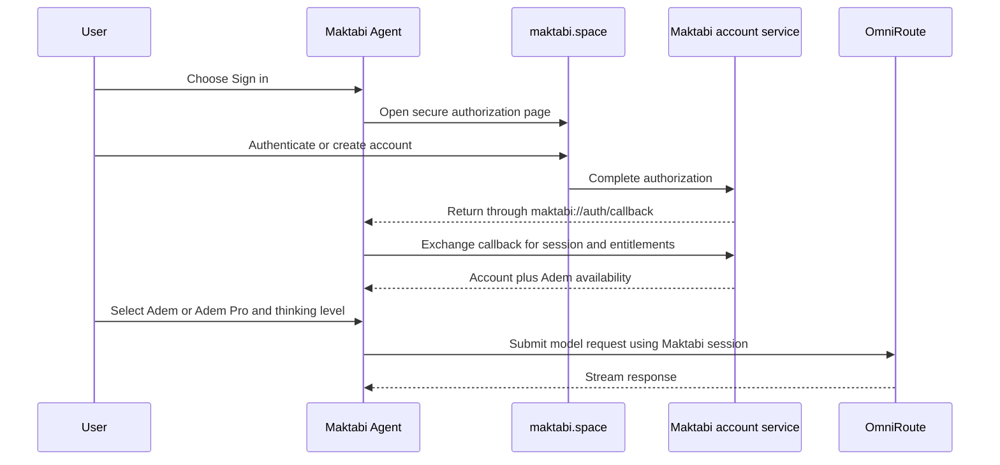

# Maktabi Rebrand Architecture

Status: approved baseline; visual mark confirmed  
Product: Maktabi Agent  
Primary release: Windows desktop  
Brand home: `https://maktabi.space`  
Last reviewed: 2026-09-24

## Purpose

This document defines the ownership and boundaries of the ZCode-to-Maktabi rebrand. It covers customer-visible identity, graphical assets, operating-system identity, outbound links, and the future Maktabi account/model integration. It does not authorize a mechanical rename of every internal `zcode` symbol.

The rebrand is complete only when a customer can install, launch, sign in to, use, update, and get help from Maktabi Agent without encountering ZCode or Z.ai product identity, except inside legally required attribution and an explicit “Based on ZCode” notice.

## Approved product rules

| Concern | Decision |
| --- | --- |
| Umbrella brand | Maktabi |
| Desktop product | Maktabi Agent |
| Preview build | Maktabi Agent Preview |
| Initial product truth | A general professional identity with coding as the first shipped capability |
| Primary platform | Windows |
| Future platforms | Reusable masters for macOS, web, and iOS; no native iOS application currently exists in this repository |
| Primary website | `maktabi.space` |
| CLI command | `maktabi` |
| Application ID | `space.maktabi.agent` |
| Deep-link protocol | `maktabi://` |
| Machine/package name | `maktabi-agent` |
| Visual tone | Minimal, geometric, approachable, professional, and suitable across Algerian professions |
| Brand colors | Obsidian `#09090B` and White `#FFFFFF` |
| Neutrals | White and gray may be used as functional interface neutrals and negative space |
| Typography | Manrope for Latin brand communication; Tajawal Bold for Arabic graphic collateral; final logo wordmarks converted to outlines |
| Languages | English, French, and Modern Standard Arabic with RTL support; no Darija in the first release |
| Theme | Near-black experience is the default and marketing reference; light mode remains available |
| Model service | Maktabi account and Adem family; OmniRoute remains an internal routing implementation |
| Adem | Low and Moderate thinking levels |
| Adem Pro | Low, Moderate, High, and Max thinking levels |
| Other providers | Available only through an advanced custom-provider path |
| Legal provenance | Preserve required licenses and notices; add “Based on ZCode” to legal notices |

## Rebrand layers

### Layer 1: brand source of truth

`branding/maktabi/` owns editable masters, approved exports, visual rules, and the route map. Runtime packages consume exported copies; they do not become the canonical source.

### Layer 2: product presentation

The shared UI owns application-facing marks, onboarding art, empty states, login presentation, theme names, and localized product copy. Desktop and web should consume the shared identity wherever possible rather than maintaining separate drawings.

### Layer 3: platform identity

Desktop packaging owns the Windows executable identity, installer icon, shortcuts, Start menu entry, AppUserModelID, protocol registration, publisher metadata, and application resources. Preview and production remain separately installable.

### Layer 4: service identity

Maktabi’s control plane owns login, account entitlement, model catalogue, downloads, updates, documentation, feedback, community, plugin distribution, and conversation sharing. Source strings must not be changed to `maktabi.space` until each destination exists and has the required contract.

### Layer 5: compatibility identity

Internal package names, protocol type names, persisted directories, environment variables, and telemetry keys are compatibility-sensitive. They are migrated deliberately after customer-facing identity is complete. Compatibility aliases may be required for existing users and plugins.

## Owners and interfaces

| Surface | Current owner | Future owner | Interface or contract |
| --- | --- | --- | --- |
| Brand masters | None | `branding/maktabi/source/` | Approved SVG master and export manifest |
| Shared UI identity | `packages/ui` | `packages/ui` | One public Maktabi logo component plus exported assets |
| Desktop package identity | `packages/desktop/scripts/desktop-product-identity.mjs` | Same module | Product name, app ID, executable/package names, preview flavor |
| Windows installer | `packages/desktop/electron-builder.config.js` and `packages/desktop/build/` | Same package | Electron Builder and NSIS assets/metadata |
| Deep links | Desktop registration plus web share/auth callers | Shared product endpoint contract | `maktabi://` with an explicit transition policy |
| Login endpoints | Shared endpoint resolver and auth adapters | Maktabi server configuration | Browser authorization, callback, token exchange, user info |
| Model catalogue | Built-in provider config and services | Maktabi model service | Adem/Adem Pro entitlements and thinking levels |
| Product links | Shared config and UI constants | Maktabi service configuration | Docs, download, support, community, privacy, terms, status |
| Updates | Desktop update provider and manifests | Maktabi release service | Signed channel manifest and downloadable artifacts |
| Localization | `packages/ui/src/i18n` and CLI i18n | Same packages | English, French, Arabic catalogue and RTL behavior |
| Legal notices | Root `LICENSE`, `NOTICE.md`, third-party notices | Repository/release packaging | Preserve upstream and third-party obligations |

## Intended account and model sequence

Endpoint paths are placeholders until the Maktabi server contract is supplied.

The user-facing provider is Maktabi. OmniRoute may appear in diagnostics when needed, but it is not a login choice, model brand, or first-run destination.

## Identity migration boundaries

### Customer-facing migration

The implementation must cover:

- Application, preview, executable, installer, shortcut, Start menu, taskbar, tray, window, and About identity.
- Welcome, login, startup, onboarding, empty-state, model, banner, and share-page graphics.
- English, French, and Arabic product copy, titles, ARIA labels, and accessible names.
- Documentation, download, support, community, feedback, privacy, terms, status, update, marketplace, share, and authentication destinations.
- User-agent strings or public metadata that identify the distributed product.
- Public repository and support metadata when the new GitHub organization and email are provided.

### Deferred internal migration

The following require dedicated compatibility specifications and must not be bulk-renamed during the graphic implementation:

- Workspace package scope `@zcode/*` and TypeScript symbols such as `ZCodeAgentService`.
- Existing `.zcode` project and user data directories.
- `ZCODE_*` environment variables and stored preference keys.
- Protocol content types, telemetry keys, RPC channel identifiers, and plugin manifest formats.
- Existing plugin marketplace IDs and saved configuration values.

These identifiers can remain invisible implementation details during the visual release. A later migration must define reads, writes, aliases, upgrade behavior, and rollback.

## Service replacement policy

| Current dependency | Maktabi rule |
| --- | --- |
| Z.ai/BigModel OAuth | Replace with the Maktabi account contract |
| ZCode/Coding Plan billing | Replace with Maktabi entitlement and PayPart integration when its contract is supplied |
| ZCode model gateway | Replace with the Maktabi service backed by OmniRoute |
| ZCode plugin CDN | Disable or replace with a Maktabi-owned marketplace; never silently proxy the upstream brand |
| ZCode conversation sharing | Disable until a Maktabi share service exists, then use Maktabi URLs and `maktabi://` imports |
| ZCode desktop update feed | Disable for public builds until signed Maktabi artifacts and manifests exist |
| ZCode docs/download | Point only to live Maktabi pages |
| Z.ai purchase links | Remove from the default experience |
| GLM/Z.ai provider art | Remove from default Maktabi surfaces; preserve only if explicitly offered later as a third-party provider |

## Visual system architecture

The confirmed symbol is an Obsidian rounded-square workspace containing a White three-volume book/file rhythm: one leaning volume and two upright volumes. The supplied raster is a compositional reference only, not artwork or a geometry specification. Maktabi's mark is rebuilt on a 120-unit grid from three identical 18 × 68-unit book modules, set on 29-unit center spacing; only the first module rotates by 10 degrees. It expresses a personal library, organized work, and an open-book gesture without tying the product to coding or one profession. It must remain recognizable at 16 px and must not depend on text, gradients, shadows, or cultural clichés. Concepts 01–03 are rejected exploration and must not be used as production sources.

The final family will contain:

- Symbol-only master, horizontal Latin lockup, Arabic collateral lockup, and bilingual collateral lockup.
- Obsidian/White primary treatment and one-color accessibility variants.
- Production and Preview application icons.
- Windows ICO and PNG size ladder, taskbar/window icon, tray icon, installer icon, and installer header artwork.
- Web favicon and social/avatar exports.
- Adem family icon with a restrained Pro modifier.
- Startup badge, login/welcome hero, model connection illustration, completion graphic, and conversation empty state.
- Reusable future macOS and iOS app-icon masters after the Windows mark is approved.

## Legal boundary

The root Apache-2.0 license, `NOTICE.md`, and third-party notices remain part of source and distributed artifacts as required. The legal surface will identify Maktabi’s own copyright and include a clear “Based on ZCode” entry with the upstream license information. Normal navigation, onboarding, marketing, and product chrome use Maktabi identity only.

This is a product and implementation boundary, not legal advice. Release review must verify the actual obligations of every redistributed font, icon, binary, and artwork source.

## Acceptance architecture

A rebrand implementation is ready for release when all of these hold:

1. A built Windows installer, installed application, taskbar, tray, Start menu, shortcuts, file properties, About window, logs offered to users, and uninstall flow present Maktabi Agent.
2. A clean first run shows Maktabi art and Maktabi destinations in English, French, and Arabic, including RTL layout.
3. No interactive customer surface opens a Z.ai, ZCode, Zhipu Feishu, or upstream Discord destination.
4. Adem and Adem Pro are the only first-party model choices; thinking levels follow the approved entitlement rules.
5. A repository scan classifies every residual `ZCode`, `zcode`, `Z.ai`, `z.ai`, and `zai-org` match as legal, internal compatibility, test fixture, third-party provider, or unresolved defect.
6. The distributed notices preserve required attribution and contain “Based on ZCode.”
7. Production and Preview can coexist and are visually distinguishable.
