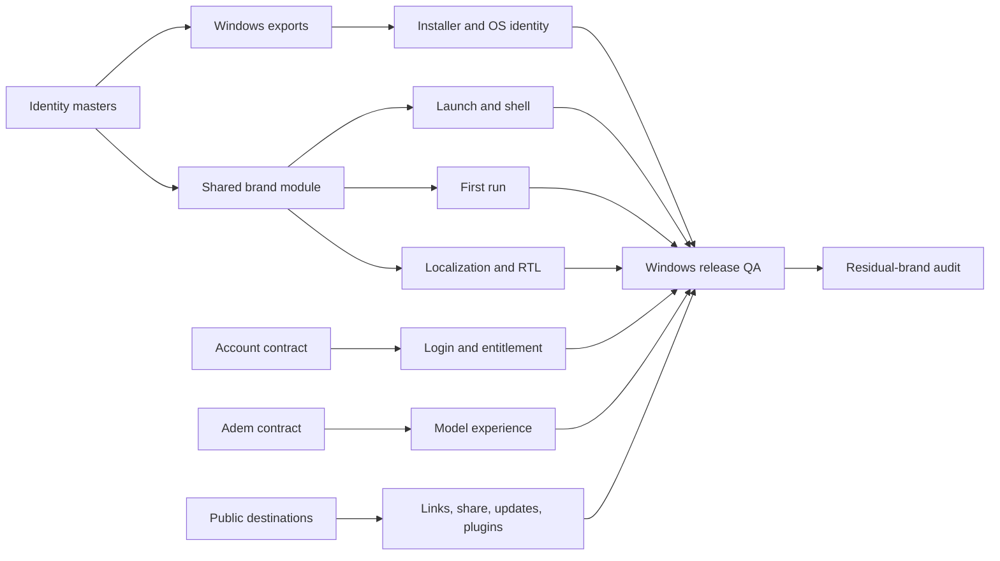

# Maktabi Windows Rebrand Ticket Graph

Status: approved planning baseline  
Application baseline: ZCode v3.14.3, commit `29628c9`  
Harness root: `../zcode-harness`  
Last reviewed: 2026-09-27

## Scope and rules

This graph covers the full Windows customer journey. It does not authorize runtime changes by itself; each ticket is implemented only after its dependencies and blockers are satisfied. macOS and iOS are future backlog. Missing Maktabi services become explicit blocked tickets, never guessed URLs or silent upstream fallbacks.

Status vocabulary:

- `ready`: enough product truth exists to start after dependencies.
- `in-progress`: actively being produced.
- `blocked`: requires a named external input or unfinished dependency.
- `future`: intentionally outside the Windows milestone.
- `complete`: acceptance evidence exists.

## Dependency flow

## Tickets

| ID | Ticket | Status | Depends on |
| --- | --- | --- | --- |
| [MKT-001](tickets/MKT-001-connect-github.md) | Connect the Maktabi GitHub repository when details are supplied | in-progress | Repository creation/publish access |
| [MKT-002](tickets/MKT-002-freeze-brand-manifest.md) | Freeze approved identity masters and manifest | complete | Phase 2 P2-02–P2-08 |
| [MKT-003](tickets/MKT-003-maintain-route-inventory.md) | Maintain the asset, text, link, and compatibility inventory | in-progress | none |
| [MKT-101](tickets/MKT-101-windows-asset-export-matrix.md) | Produce the Windows icon and shared export matrix | complete | MKT-002 |
| [MKT-102](tickets/MKT-102-experience-graphics.md) | Produce startup, first-run, model, ready, and empty-state graphics | in-progress | MKT-002 |
| [MKT-103](tickets/MKT-103-asset-validation.md) | Validate geometry, sizes, contrast, metadata, and checksums | blocked | MKT-101, MKT-102 |
| [MKT-201](tickets/MKT-201-shared-brand-module.md) | Add the shared Maktabi brand module and tokens | blocked | MKT-002, MKT-101 |
| [MKT-202](tickets/MKT-202-localization-rtl.md) | Add English, French, Arabic, and RTL product coverage | ready | focused localization spec |
| [MKT-203](tickets/MKT-203-legal-provenance.md) | Add Maktabi legal presentation and “Based on ZCode” | ready | legal review |
| [MKT-301](tickets/MKT-301-windows-installer-identity.md) | Rebrand install, upgrade, Preview, shortcuts, and uninstall | blocked | MKT-101, signing inputs |
| [MKT-302](tickets/MKT-302-launch-shell-about.md) | Rebrand launch, taskbar, tray, shell, and About | blocked | MKT-201 |
| [MKT-303](tickets/MKT-303-first-run-onboarding.md) | Rebrand first run, welcome, and onboarding | blocked | MKT-102, MKT-201, MKT-202 |
| [MKT-304](tickets/MKT-304-account-auth-contract.md) | Define and implement the Maktabi account flow | blocked | auth contract |
| [MKT-305](tickets/MKT-305-adem-model-contract.md) | Define and implement Adem and Adem Pro | blocked | model/OmniRoute contract, MKT-304 |
| [MKT-306](tickets/MKT-306-workspace-empty-states.md) | Rebrand the main workspace, model UI, and empty states | blocked | MKT-102, MKT-201, MKT-305 |
| [MKT-307](tickets/MKT-307-cli-public-identity.md) | Rebrand the CLI and other public runtime identity | blocked | CLI compatibility spec |
| [MKT-308](tickets/MKT-308-help-docs-social-links.md) | Route help, docs, support, feedback, and social links | blocked | destination catalogue |
| [MKT-309](tickets/MKT-309-share-remote-protocol.md) | Replace or disable sharing, web remote, and public deep links | blocked | share/remote contracts |
| [MKT-310](tickets/MKT-310-updates-downloads-releases.md) | Replace update, download, and release infrastructure | blocked | hosting/signing/release contracts |
| [MKT-311](tickets/MKT-311-plugins-official-content.md) | Replace or disable marketplace and official-content routes | blocked | marketplace/CDN decision |
| [MKT-312](tickets/MKT-312-bots-channel-policy.md) | Rebrand bots and decide Algerian-market channel support | blocked | channel policy |
| [MKT-313](tickets/MKT-313-paypart-entitlements.md) | Integrate PayPart and entitlement refresh | blocked | PayPart contract, MKT-304 |
| [MKT-401](tickets/MKT-401-windows-release-qa.md) | Verify the complete Windows customer journey | blocked | MKT-203, MKT-301–MKT-313 |
| [MKT-402](tickets/MKT-402-residual-brand-audit.md) | Audit source, built artifacts, visuals, and clickable routes | blocked | MKT-401 |
| [FUT-501](tickets/FUT-501-internal-identifier-migration.md) | Plan compatibility-safe internal identifier migration | future | stable Windows release |
| [FUT-502](tickets/FUT-502-macos-packaging.md) | Produce and verify macOS packaging | future | stable Windows release |
| [FUT-503](tickets/FUT-503-ios-product.md) | Specify and build a future native iOS product | future | separate iOS product plan |

## Blocker register

| Input owner | Required input | Unblocks |
| --- | --- | --- |
| Maktabi owner | GitHub repository creation/publish access | MKT-001, README/release metadata |
| Maktabi platform | Auth endpoints, callback, session, user-info contract | MKT-304 |
| Maktabi platform | Adem IDs, context/limits, entitlements, streaming schema | MKT-305 |
| Maktabi platform | PayPart checkout/webhook/entitlement contract | MKT-313 |
| Maktabi owner | Docs, support, feedback, privacy, terms, status, community URLs and email | MKT-308 |
| Maktabi platform | Share and remote-control contract | MKT-309 |
| Release owner | Download host, update manifest, signing certificate, publisher identity | MKT-301, MKT-310 |
| Product owner | Marketplace and official-content policy/CDN | MKT-311 |
| Product owner | Supported bot channels for Algeria and data-handling policy | MKT-312 |

## Phase 2 relationship

The detailed identity tickets under `phase-2/tickets/` remain the controlling work items for source artwork. `MKT-002` closes only after P2-01 through P2-08 are approved and the manifest is frozen. No duplicated Phase 2 tickets are created here.
