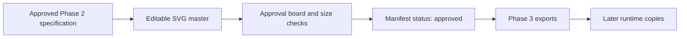

# Phase 2 — Maktabi Brand Asset System Specification

Status: complete
Phase owner: Maktabi product owner  
Source of truth: `branding/maktabi/`  
Started: 2026-09-24

## Objective

Turn the confirmed Concept 04 symbol into a complete, reusable identity system before any runtime package consumes it. Phase 2 produces controlled vector masters, usage rules, approval metadata, and an export-ready manifest. It does not replace ZCode assets inside the application.

## Approved inputs

| Concern | Locked decision |
| --- | --- |
| Brand | Maktabi |
| Desktop product | Maktabi Agent |
| Preview product | Maktabi Agent Preview |
| Primary symbol | Rounded workspace containing one leaning book and two upright books |
| Primary colors | Obsidian `#09090B` and White `#FFFFFF` only |
| Latin construction font | Manrope |
| Arabic construction font | Tajawal Bold |
| Languages | English, French, and Modern Standard Arabic; no Darija |
| Default environment | Near-black application UI |
| Primary platform | Windows desktop |
| Legal provenance | Preserve required notices and add “Based on ZCode” in legal surfaces |

Concepts 01–03 are rejected. The user-supplied raster is a composition reference only and is not a Maktabi asset, geometry source, or distributable file.

## Scope

### In scope

- Production symbol master.
- Latin `Maktabi Agent` horizontal lockup.
- Arabic `مكتبي` lockup.
- Bilingual lockup.
- Primary and one-color accessibility variants.
- Clear-space, background, and minimum-size rules.
- Production and Preview identity distinction.
- Adem and Adem Pro model marks.
- Machine-readable asset manifest and review metadata.
- Approval boards and small-size checks.

### Out of scope

- Copying files into `packages/ui`, `packages/desktop`, `packages/web`, or `public`.
- Generating Windows ICO/PNG ladders; that is Phase 3.
- Replacing visible product text, links, authentication, models, installers, or application code.
- Renaming internal `@zcode/*`, `.zcode`, `ZCODE_*`, protocol, or persistence identifiers.
- Creating first-run illustrations and banners; that is Phase 4.

## Ownership and write path

`branding/maktabi/source/` is the only owner of editable masters. `branding/maktabi/inventory/ASSET_MANIFEST.json` owns version and approval state. `branding/maktabi/inventory/ASSET_ROUTE_MAP.md` owns future runtime destinations. Package-level assets are downstream exports and must never become the editing source.

The write sequence is:

## Symbol geometry

The production symbol uses a `120 × 120` coordinate system.

| Element | Measurement |
| --- | ---: |
| Container | `120 × 120` |
| Container corner radius | `29` |
| Book module | `18 × 68` |
| Book corner radius | `2` |
| Book centers | `31`, `60`, `89` on the x-axis |
| Book center spacing | `29` |
| Book vertical origin | `26` |
| First-book rotation | `10°` around `(31, 60)` |
| Other rotations | `0°` |

All three books must be instances of the same geometry. No book may be stretched, redrawn, or hand-spaced. The controlled rotation is the only structural difference.

## Color and background rules

The standard application icon is always an Obsidian container with White books. It is not color-inverted on light backgrounds. Gray may support layouts and boundaries but is not a logo color.

| Context | Treatment |
| --- | --- |
| Light background | Unchanged primary Obsidian/White mark |
| Near-black application background | Unchanged primary mark on a slightly lighter neutral field or with external padding |
| Pure black field | Do not bake a stroke into the master; provide separation in the containing UI or export canvas |
| One-color dark requirement | Obsidian silhouette with book shapes knocked out |
| One-color light requirement | White silhouette with book shapes knocked out |

Forbidden treatments include orange/gold, purple, gradients, shadows, glow, bevels, transparency inside the core mark, and recolored professional variants.

## Wordmark construction

### Latin

- Text content: `Maktabi` with product descriptor `AGENT`.
- Construction reference: Manrope ExtraBold/Bold for `Maktabi`; Manrope Bold for `AGENT`.
- `AGENT` may use uppercase tracking between `0.10em` and `0.14em`.
- Optical kerning is allowed; horizontal or vertical glyph scaling is not.
- The production wordmark must be converted to SVG outlines while retaining a separate editable text reference.

### Arabic

- Text content: `مكتبي`.
- Construction reference: Tajawal Bold.
- The word must be shaped as Arabic text before outline conversion; isolated or mechanically mirrored glyphs are forbidden.
- Composition is right-to-left: the `مكتبي` wordmark is placed on the left and the symbol is placed on the right. The symbol itself is not mirrored.
- Arabic lettering receives its own optical spacing and is not forced to match Latin width.

### Runtime graphic boundary

- Arabic and bilingual lockups are approved graphic collateral for marketing, documentation, and other selected non-app surfaces.
- The final Windows desktop app uses Latin graphic assets only for its icon, shell, onboarding, About, and other in-app brand artwork.
- Arabic localization remains a supported language concern, but it does not import Arabic logo artwork into the desktop application.

### Bilingual

- Combine the approved Latin and Arabic wordmarks without duplicating the symbol.
- Preserve correct RTL reading order for Arabic.
- Use alignment and whitespace to express equivalence; do not use a slash, flag, or translation icon.

## Lockup and size rules

Define `x` as one book-module width: `18/120` of the symbol width.

- Minimum clear space around symbol-only uses: `1x`.
- Minimum clear space around lockups: `1x` around the complete lockup.
- Minimum production symbol: `16 px` only when using the dedicated Phase 3 pixel export; `24 px` preferred in UI.
- Minimum horizontal Latin lockup: `120 px` wide.
- Minimum Arabic lockup: determined by the approved proof, never below the height of a `24 px` symbol.
- Below the lockup minimum, use the symbol only.
- Preserve aspect ratio and never rearrange an approved lockup inside consuming code.

## Preview identity

The core symbol cannot change. Preview differentiation must be an external, two-color-compatible modifier that remains recognizable at 16 px and does not imply an error or notification state. Ticket P2-06 must compare small-size treatments before one is approved. Text-only `PREVIEW` labels may accompany large lockups but cannot be the only distinction in taskbar and installer icons.

## Adem model identity

Adem and Adem Pro are subordinate product marks, not alternate Maktabi logos.

- Adem derives an `A` from the same module and corner logic as the Maktabi symbol.
- Adem Pro keeps the same base `A` and adds one restrained external modifier.
- Both use Obsidian/White only.
- Thinking levels remain text and never become extra logo variants.
- OmniRoute receives no customer-facing brand mark.

## Required masters

| Asset | Canonical path | Phase 2 state |
| --- | --- | --- |
| Primary symbol | `branding/maktabi/source/maktabi-agent-mark-primary.svg` | approved |
| Latin horizontal lockup | `branding/maktabi/source/maktabi-agent-lockup-latin-horizontal.svg` | approved |
| Arabic horizontal lockup | `branding/maktabi/source/maktabi-agent-lockup-ar-horizontal.svg` | approved; collateral-only |
| Bilingual lockup | `branding/maktabi/source/maktabi-agent-lockup-bilingual.svg` | approved; collateral-only |
| Preview symbol | `branding/maktabi/source/maktabi-agent-mark-preview.svg` | approved |
| One-color dark symbol | `branding/maktabi/source/maktabi-agent-mark-one-color-dark.svg` | approved |
| One-color light symbol | `branding/maktabi/source/maktabi-agent-mark-one-color-light.svg` | approved |
| Adem mark | `branding/maktabi/source/adem-model-mark.svg` | approved |
| Adem Pro mark | `branding/maktabi/source/adem-pro-model-mark.svg` | approved |

Each wordmark also requires a review-only editable-text source before its approved outlined SVG is written.

## Acceptance scenarios

1. The production symbol XML is valid and contains only `#09090B` and `#FFFFFF` fills.
2. The three books resolve to identical `18 × 68` geometry and centers separated by `29` units.
3. Symbol and lockup proofs remain identifiable at their stated minimum sizes on light and near-black fields.
4. Latin, Arabic, and bilingual outlined masters do not depend on a font being installed at runtime.
5. Arabic renders in correct reading order and the symbol is not mirrored.
6. Production and Preview are distinguishable at 16, 24, and 32 px without changing the core symbol.
7. Adem and Adem Pro are visibly related, remain subordinate to Maktabi, and use no extra colors.
8. Every canonical master has an entry in `ASSET_MANIFEST.json` with version, source, status, and approval metadata.
9. Every planned runtime copy points back to a canonical master in `ASSET_ROUTE_MAP.md`.
10. No runtime package or application code changes during Phase 2.

## Verification

- Parse every SVG as XML.
- Search approved masters for colors outside `#09090B` and `#FFFFFF`.
- Render proof boards at 100% and inspect 16, 24, 32, 64, and 256 px.
- Verify transparent corners and no accidental raster embedding.
- Confirm outlined wordmarks contain no `<text>` nodes.
- Run `git diff --check`.

Repository typecheck, lint, and architecture checks are not required for documentation/vector-only Phase 2 tickets. They become mandatory when runtime code changes begin.

## Approval gates

| Gate | Required evidence | Status |
| --- | --- | --- |
| G1 — Symbol master | Geometry, palette, XML validation, small-size proof | approved |
| G2 — Latin wordmark | Text reference, outlined master, horizontal proof | approved |
| G3 — Arabic wordmark | RTL text reference, outlined master, Arabic review | approved |
| G4 — Bilingual lockup | Combined proof in LTR and RTL layouts | approved |
| G5 — Preview modifier | 16–64 px comparison with Production | approved |
| G6 — Adem family | Adem/Pro relationship and model-list proof | approved |
| G7 — Manifest freeze | All entries versioned, routed, and approved | approved |

Phase 2 completes only when G1–G7 are approved.
