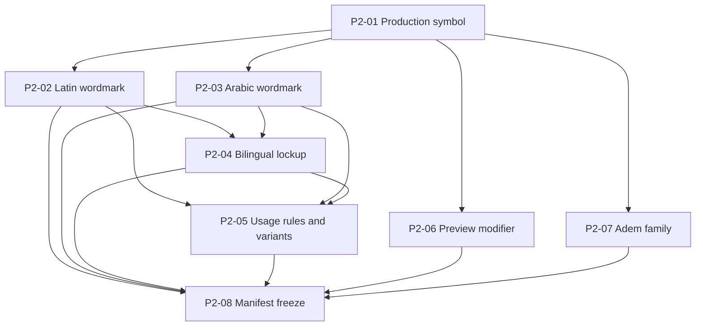

# Phase 2 Ticket Index

Status: complete
Specification: `PHASE_2_BRAND_ASSET_SYSTEM_SPEC.md`

## Dependency graph

## Work order

| Ticket | Title | Status | Blocked by |
| --- | --- | --- | --- |
| P2-01 | Promote confirmed production symbol | complete | — |
| P2-02 | Finalize Latin wordmark and lockup | complete | P2-01 |
| P2-03 | Finalize Arabic wordmark and lockup | complete | P2-01 |
| P2-04 | Build bilingual lockup | complete | P2-02, P2-03 |
| P2-05 | Complete variants and usage rules | complete | P2-02, P2-03, P2-04 |
| P2-06 | Design Preview modifier | complete | P2-01 |
| P2-07 | Design Adem and Adem Pro marks | complete | P2-01 |
| P2-08 | Freeze manifest and Phase 2 approvals | complete | P2-02–P2-07 |

P2-02, P2-03, P2-06, and P2-07 may proceed independently. P2-04 and P2-05 protect composition consistency; P2-08 is the only Phase 2 exit ticket.
